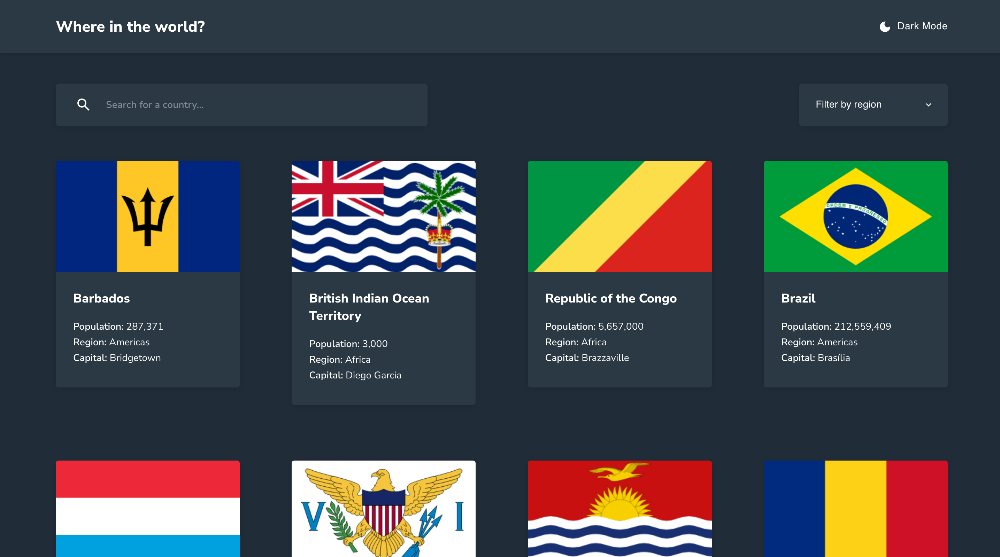

# Frontend Mentor - REST Countries API with color theme switcher solution

This is a solution to the [REST Countries API with color theme switcher challenge on Frontend Mentor](https://www.frontendmentor.io/challenges/rest-countries-api-with-color-theme-switcher-5cacc469fec04111f7b848ca).

## Table of contents

- [Overview](#overview)
  - [The challenge](#the-challenge)
  - [Screenshots](#screenshots)
  - [Links](#links)
- [Process](#process)
  - [Built with](#built-with)
  - [Useful resources](#useful-resources)

## Overview

### The challenge

Users should be able to:

- Preview all countries from the API on the homepage
- Click through different pages of countries
- Search for a country using an `input` field
- Filter countries by region
- Search for a country within a specific region (combined Filter + Search)
- Click on a country to see more detailed information on a separate page
- Click through to the border countries on the detail page
- Toggle the color scheme between light and dark mode

### Screenshots

| Light mode                       | Dark Mode                       |
| -------------------------------- | ------------------------------- |
|     |     |
|  |  |

### Links

- Solution URL: [Github pages](https://rest-countries-api-with-color-theme-switcher-ayakh99.vercel.app)

## Process

### Built with

- React.js
- [MUI](https://mui.com)
- SASS
- Express.js

### Useful resources

[How To Create A Custom React Hook To Fetch And Cache Data](https://www.smashingmagazine.com/2020/07/custom-react-hook-fetch-cache-data/)
